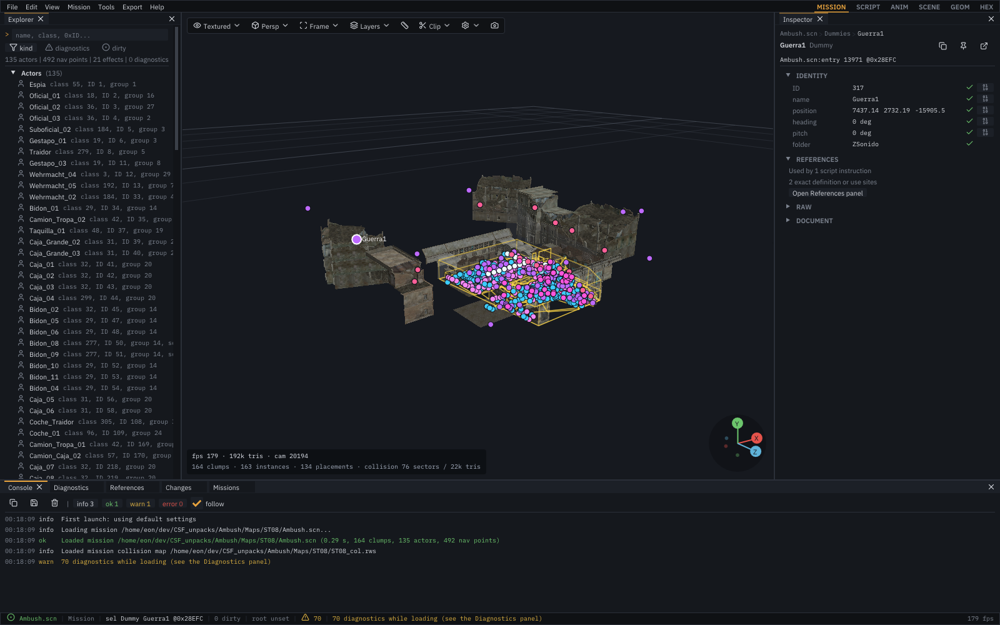

# csf-rws-tools

csf-rws-tools is a Windows and Linux inspection and reverse-engineering toolkit
for RenderWare Binary Stream (`.rws`) assets from *Commandos: Strike Force*. It
provides the `rws-man` graphical chunk browser and 3D scene preview, command-line
analysis tools, OBJ/glTF export, and a Blender add-on for inspecting and rebaking
the game's lightmaps.



The project is under active development. It understands many structures used by
*Commandos: Strike Force*, but it is not a general-purpose RenderWare editor and
does not claim complete format support. Unknown and truncated data is preserved so
that partially understood assets can still be inspected safely.

## Features

- Bounds-checked parsing of little-endian RenderWare chunk streams.
- Read-only, bounds-checked parsing of generic `CSFFBS` documents with retained
  raw tables, source offsets, diagnostics, and validated group/array trees.
- Schema-aware inspection of Clumps, Geometry, Materials, Worlds, Frame Lists,
  Atomics, Skin, HAnim, User Data, Bin Mesh, MatFX, and other common plugins.
- ANM `0x1B` decoding, track recovery, pose evaluation, selected-actor CPU
  skinning, playback controls, root motion, and animation glTF export.
- Typed `Anims.bdd` catalogs and conservative CSC cutscene basic-block lanes
  with explicit branches and runtime waits. A dedicated Animation workspace
  traces SCN actor script IDs through GSC `PLAY_ANMBDD*` actions to exact BDD
  records and highlights cutscene camera dummies.
- Decoding of game-specific Pyro Studios metadata, Physics Body/Ragdoll data, and
  CSF scene-instance records.
- A Dear ImGui desktop application with a chunk tree, typed inspectors, hex
  editing, drag-and-drop loading, and save-to-copy behavior.
- Depth-tested OpenGL previews for individual geometry and assembled scenes,
  including DDS and PNG base textures, secondary-UV lightmaps, material
  diagnostics, and wireframe modes. Map previews automatically discover a
  same-directory
  `_col.rws` sibling and can show its recovered level collision as a translucent,
  surface-colored, wireframe, or X-ray overlay.
- Shared, range-checked World-sector and validated BSP topology recovery used by the GUI, glTF exporter,
  `rws-info`, and `rws-corpus`, while the conservative parsed chunk tree remains
  unchanged.
- Wavefront OBJ export for individual geometry and collision-only Worlds.
- glTF 2.0 export for Clumps and assembled scenes, with two UV channels,
  materials, world sectors, CSF placements, and a texture/source manifest.
- Corpus-wide inventory and validation tools for reverse-engineering collections
  of `.rws` files.
- A Blender 4.0+ add-on for resolving exported materials, previewing lightmaps,
  preparing Cycles bakes, and staging game-ready DXT1/DXT3 DDS files.
- A mission editor: move, turn, duplicate, add and delete actors, dummies, lights,
  navigation points and map props with viewport gizmos; change an actor's class
  (model) and animation overrides; edit mission properties and scripts as
  recompilable text; import classes and animations from other missions; undo and
  redo everything; save into a mod project; and export a complete replacement
  `maps/<Mission>.pak` that keeps every unchanged archive record byte-for-byte.

No game files are included. You must supply assets from your own installation.
This project is not affiliated with Pyro Studios, Eidos Interactive, or the
RenderWare rights holders.

## Project layout

| Component | Purpose |
| --- | --- |
| `rws-man` | Desktop chunk inspector, hex editor, and 3D preview |
| `rws-info` | Inspect, validate, and export one `.rws` or Clump `.rpc` file |
| `rws-corpus` | Recursively inventory a directory of `.rws` and `.rpc` files |
| `rws_core` | Parser, typed decoders, and export library used by all tools |
| `csf-info` | Summarize, validate, search, and inspect one `CSFFBS` document |
| `csf-mod` | Mission editing (`mission-edit`), full mission archive export (`export-mission`), recompilable CSFFBS text (`decompile`/`compile`), guarded field edits, staging, PAK packaging, deployment, and rollback |
| `csf_core` | Generic `CSFFBS` parser, canonical tree writer, source text, typed views, mission editor, and mod-project model |
| `tools/blender/rws_lightmaps` | Blender material, bake, and DDS staging add-on |

## Documentation

Full documentation lives in [docs/index.md](docs/index.md). The most useful
starting points:

- [Command-line usage](docs/guides/cli.md) and
  [GUI usage](docs/guides/gui.md).
- [Mission editor](docs/guides/mission-editor.md) and
  [guarded authoring and mods](docs/guides/guarded-authoring-and-mods.md).
- Format notes in [docs/game-knowledge/rws-format.md](docs/game-knowledge/rws-format.md)
  and [docs/game-knowledge/csffbs-format.md](docs/game-knowledge/csffbs-format.md);
  corpus results in [docs/game-knowledge/rws-corpus.md](docs/game-knowledge/rws-corpus.md)
  and [docs/game-knowledge/resources.md](docs/game-knowledge/resources.md).

## Requirements

Windows x64:

- Visual Studio Build Tools 2026 (18.9.2) with the **Desktop development with
  C++** workload.

Linux:

- GCC 13+ or Clang 16+ with C++20 support, plus Ninja and `pkg-config`.
- X11 and/or Wayland development headers and an OpenGL-capable driver for the GUI.
  On Fedora:

  ```bash
  sudo dnf install mesa-libGL-devel mesa-libEGL-devel libglvnd-devel \
      libX11-devel libXext-devel libXrandr-devel libXi-devel libXcursor-devel \
      libXinerama-devel libXxf86vm-devel libXrender-devel libXfixes-devel libxcb-devel \
      xorg-x11-proto-devel wayland-devel wayland-protocols-devel libxkbcommon-devel
  ```

Both platforms:

- CMake 3.24 or newer, available on `PATH`.
- Git, available on `PATH` (used to fetch the pinned dependencies).

Mission archive export links the archive library of the sibling `pak-man`
checkout when it is present at `../pak-man` (set
`RWSMAN_PAKMAN_DIR` to use another path); pak-man then fetches zlib 1.3.2.
Without it, export runs `pakman-cli` from `PATH`.

CMake downloads the pinned GLFW 3.4, Dear ImGui 1.91.9b (the `-docking` tag),
stb (`stb_image` and `stb_image_write`), and portable-file-dialogs sources the first
time the build is configured. stb supplies portable PNG decoding and screenshot
encoding, so no system image library is required on either platform. The GUI embeds
its fonts (Inter, IosevkaTerm, and a Lucide icon subset; licenses are in
`app/ui/fonts/LICENSES.md`) and needs no system fonts. On Linux, the native
**Open** dialogs use `zenity` or `kdialog` when one is installed; without either you
can still start from the command line or drag and drop. The core-only build does
not require GLFW, ImGui, or OpenGL.

## Quick start

Open PowerShell on Windows or a terminal on Linux in the repository root.

Windows:

```powershell
.\build.ps1
.\test.ps1
.\build\Release\rws-man.exe "C:\path\to\asset.rws"
```

Linux:

```bash
./build.sh
./test.sh
./build/Release/rws-man "/path/to/asset.rws"
```

You can also start the GUI without an argument and drag an `.rws` or `.rpc` file onto
the window.

Both scripts build **Release** by default. They use the checked-in CMake presets,
perform parallel incremental builds, and configure a build tree only when it is
missing. Useful variants are:

```powershell
# Debug build and tests
.\build.ps1 -Config Debug
.\test.ps1 -Config Debug

# Build only the GUI and its dependencies
.\build.ps1 -Target rws-man

# Build the parser, command-line tools, and tests without GUI dependencies
.\build.ps1 -CoreOnly
.\test.ps1 -CoreOnly

# Force CMake to configure the selected build tree again
.\build.ps1 -Reconfigure

# Run tests without rebuilding the test executable
.\test.ps1 -NoBuild
```

```bash
# Debug build and tests
./build.sh --config Debug
./test.sh --config Debug

# Build only the GUI and its dependencies
./build.sh --target rws-man

# Build the parser, command-line tools, and tests without GUI dependencies
./build.sh --core-only
./test.sh --core-only

# Force CMake to configure the selected build tree again
./build.sh --reconfigure

# Run tests without rebuilding the test executable
./test.sh --no-build
```

Full-build executables are written to `build/<Config>`. Core-only executables are
written to `build-core/<Config>`.

## Known limitations

- Parsing and export behavior is based on the currently studied *Commandos:
  Strike Force* corpus; other RenderWare games and versions may differ.
- Several game-specific fields and chunk types remain unidentified.
- RWS hex edits remain structural byte edits. Mission edits are validated against
  the shipped data, but no edited mission has been played in the game yet; see
  the untested points in [docs/guides/mission-editor.md](docs/guides/mission-editor.md).
- Scene glTF export does not package or convert external DDS textures.
- Modified assets are not guaranteed to load in the game.

Confirmed structures and unresolved questions are documented rather than hidden;
start with [docs/game-knowledge/rws-format.md](docs/game-knowledge/rws-format.md) before
building new decoders or export behavior.

## Development

Keep parsing and export logic in `rws_core`; the GUI and console programs should
remain clients of that library. Parser, decoder, or exporter changes should add or
update coverage in `tests/document_tests.cpp` and pass:

Windows:

```powershell
.\test.ps1
```

Linux:

```bash
./test.sh
```

Generated `build*`, `_deps`, and Python `__pycache__` content must not be committed.
Do not add copyrighted game assets, extracted resources, or generated exports to
the repository.

When reporting a parser problem, include the tool, command, diagnostic text, and
chunk offsets involved. Share a minimal byte sample only if you have the right to
redistribute it.

## License

csf-rws-tools is available under the [MIT License](LICENSE).
