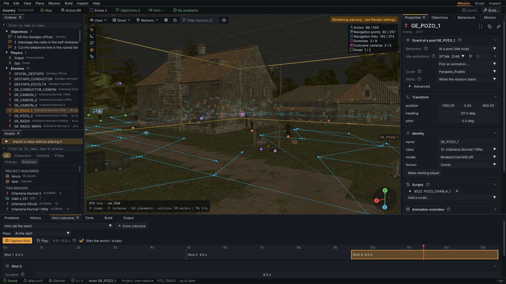

# CSF Mission Editor

CSF Mission Editor (`csf-editor`) makes new missions for *Commandos: Strike
Force* on Windows and Linux. Build the map in Blender or assemble it from
pieces of the shipped missions, place soldiers, animals, vehicles and props,
give them behaviours, write objectives, triggers and cutscenes without typing
script text, and build a replacement mission archive that it deploys to a test
copy of the game and rolls back again. It grew out of a RenderWare `.rws`
inspection toolkit, which lives on as its Inspect mode and the command-line
tools.



The project is under active development. Two missions made with it,
[hello world](examples/hello-world/README.md) and
[Country](examples/country/README.md), are kept as worked examples; hello world
plays in the game. No game files are included: the editor reads the unpacked
game from your own installation. This project is not affiliated with Pyro
Studios, Eidos Interactive, or the RenderWare rights holders.

## Download

The [latest build](https://github.com/eonflux7/csf-editor/releases/tag/latest)
of `main` is on the Releases page: `csf-editor-<commit>-windows-x64.zip`
(Windows 10 or later, x64) and `csf-editor-<commit>-linux-x64.tar.gz` (x64,
X11 or Wayland with OpenGL). Each holds the editor, the command-line tools and
the Blender add-ons in `tools/blender`. CI replaces it after every push to
`main` that passes the tests; every CI run also keeps the same packages as
workflow artifacts. You still need the game's unpacked resources and Blender
(for map authoring); see [Mission editor](docs/guides/mission-editor.md).

## Features

**Making missions** (Mission and Script modes):

- **Projects**: a new mission in a shipped mission's slot, its own text range,
  sources and build outputs (`project.csfproj`); saved with one undo history
  for the mission and the project.
- **Maps**: terrain and buildings from Blender (the CSF authoring add-on sends
  them to the editor, which rebuilds the map, collision and sector map), pieces
  of other missions' maps with their textures and lightmaps, props, baked
  lightmaps, and a height report that keeps everything on the ground.
- **Actors and behaviours**: place any class of any mission by name, then make
  it guard a post (idle animations picked by name and previewed), patrol a
  route, take cover, or start on an event; animals walk routes.
- **Logic**: objectives that complete themselves, When/If/Do triggers (zones,
  deaths, used objects, timers, alerts, bodies found), starting kits and tips,
  and a Script mode with a source editor and the mission's flow graph.
- **Cutscenes**: the intro and zone cutscenes as timelines of travelling camera
  shots, framed and played in the viewport.
- **Checks and delivery**: a Problems list (flow, heights, texts, lighting,
  zones), then build, deploy to a test install, roll back and log playtests.
- Every recipe stays an editable **component**; the same operations run from
  the command line (`csf-mod mission-ops`) and from UI test scripts.

**Inspecting the game** (Inspect mode and command-line tools):

- Bounds-checked parsing of RenderWare chunk streams and of the generic
  `CSFFBS` documents behind missions, scripts and databases, preserving unknown
  and truncated data.
- Typed inspectors, a hex editor, 3D scene and collision previews with
  lightmaps, animation playback with skinning, and mission graphs.
- OBJ and glTF export, corpus-wide inventories, and a Blender add-on for
  rebaking the game's lightmaps.

## Project layout

| Component | Purpose |
| --- | --- |
| `csf-editor` | CSF Mission Editor: Mission, Script and Inspect modes |
| `csf-mod` | Projects and missions from the command line: `project-*`, `mission-ops`, `mission-components`, `mission-flow`, recompilable CSFFBS text (`decompile`/`compile`), packaging, deployment and rollback |
| `csf-info` | Summarize, validate, search, and inspect one `CSFFBS` document |
| `rws-info`, `rws-corpus` | Inspect, validate and export one `.rws`/`.rpc` file, or inventory a directory of them |
| `csf_core`, `rws_core` | The libraries all of them use: CSFFBS and mission model, mission editor and recipes, authoring projects; RenderWare parsing, Worlds and export |
| `tools/blender` | The CSF authoring add-on (terrain and buildings) and the lightmap add-on |
| `examples/` | Hello world and Country, each rebuilt from nothing by its script |

## Documentation

Full documentation lives in [docs/index.md](docs/index.md). The most useful
starting points:

- [Mission editor](docs/guides/mission-editor.md): a mission from start to
  finish; [GUI usage](docs/guides/gui.md) and
  [command-line usage](docs/guides/cli.md).
- [Blender authoring](docs/guides/blender-authoring.md) and the
  [authoring project format](docs/reference/project-format.md).
- The [examples](examples/README.md) and the [roadmap](docs/plans/roadmap.md).
- Format notes in [docs/game-knowledge/](docs/game-knowledge/).

## Requirements

Windows x64:

- Visual Studio Build Tools 2026 (18.9.2) with the **Desktop development with
  C++** workload.

Linux:

- GCC 13+ or Clang 16+ with C++20 support, plus Ninja and `pkg-config`.
- X11 and/or Wayland development headers and an OpenGL-capable driver for the GUI.
  On Fedora:

  ```bash
  sudo dnf install mesa-libGL-devel mesa-libEGL-devel libglvnd-devel \
      libX11-devel libXext-devel libXrandr-devel libXi-devel libXcursor-devel \
      libXinerama-devel libXxf86vm-devel libXrender-devel libXfixes-devel libxcb-devel \
      xorg-x11-proto-devel wayland-devel wayland-protocols-devel libxkbcommon-devel
  ```

Both platforms:

- CMake 3.24 or newer, available on `PATH`.
- Git, available on `PATH` (used to fetch the pinned dependencies).

Mission archive export links the archive library of the sibling `pak-man`
checkout when it is present at `../pak-man` (set
`RWSMAN_PAKMAN_DIR` to use another path); pak-man then fetches zlib 1.3.2.
Without it, export runs `pakman-cli` from `PATH`.

CMake downloads the pinned GLFW 3.4, Dear ImGui 1.91.9b (the `-docking` tag),
stb (`stb_image` and `stb_image_write`), and portable-file-dialogs sources the first
time the build is configured. stb supplies portable PNG decoding and screenshot
encoding, so no system image library is required on either platform. The GUI embeds
its fonts (Inter, IosevkaTerm, and a Lucide icon subset; licenses are in
`app/ui/fonts/LICENSES.md`) and needs no system fonts. On Linux, the native
**Open** dialogs use `zenity` or `kdialog` when one is installed; without either you
can still start from the command line or drag and drop. The core-only build does
not require GLFW, ImGui, or OpenGL.

## Quick start

Open PowerShell on Windows or a terminal on Linux in the repository root.

Windows:

```powershell
.\build.ps1
.\test.ps1
.\build\Release\csf-editor.exe
```

Linux:

```bash
./build.sh
./test.sh
./build/Release/csf-editor
```

Home then offers **New project...** (pick a shipped mission's slot) and your
recent projects; set the resource root (the unpacked game) in
`Edit > Preferences...`. A project folder, a mission `.scn`, or an `.rws` or `.rpc`
file can also be given on the command line or dropped onto the window.

Both scripts build **Release** by default. They use the checked-in CMake presets,
perform parallel incremental builds, and configure a build tree only when it is
missing. Useful variants are:

```powershell
# Debug build and tests
.\build.ps1 -Config Debug
.\test.ps1 -Config Debug

# Build only the GUI and its dependencies
.\build.ps1 -Target csf-editor

# Build the parser, command-line tools, and tests without GUI dependencies
.\build.ps1 -CoreOnly
.\test.ps1 -CoreOnly

# Force CMake to configure the selected build tree again
.\build.ps1 -Reconfigure

# Run tests without rebuilding the test executable
.\test.ps1 -NoBuild
```

```bash
# Debug build and tests
./build.sh --config Debug
./test.sh --config Debug

# Build only the GUI and its dependencies
./build.sh --target csf-editor

# Build the parser, command-line tools, and tests without GUI dependencies
./build.sh --core-only
./test.sh --core-only

# Force CMake to configure the selected build tree again
./build.sh --reconfigure

# Run tests without rebuilding the test executable
./test.sh --no-build
```

Full-build executables are written to `build/<Config>`. Core-only executables are
written to `build-core/<Config>`.

## Known limitations

- Parsing and export behavior is based on the currently studied *Commandos:
  Strike Force* corpus; other RenderWare games and versions may differ.
- Several game-specific fields and chunk types remain unidentified.
- RWS hex edits remain structural byte edits. Mission edits are validated against
  the shipped data; hello world plays in the game, and what is not yet
  confirmed there is listed in the [roadmap](docs/plans/roadmap.md).
- Scene glTF export does not package or convert external DDS textures.
- Modified assets are not guaranteed to load in the game.

Confirmed structures and unresolved questions are documented rather than hidden;
start with [docs/game-knowledge/rws-format.md](docs/game-knowledge/rws-format.md) before
building new decoders or export behavior.

## Development

Keep parsing and export logic in `rws_core` and `csf_core`; the editor and console
programs should remain clients of those libraries. Parser, decoder, or exporter changes should add or
update coverage in `tests/document_tests.cpp` and pass:

Windows:

```powershell
.\test.ps1
```

Linux:

```bash
./test.sh
```

Generated `build*`, `_deps`, and Python `__pycache__` content must not be committed.
Do not add copyrighted game assets, extracted resources, or generated exports to
the repository.

When reporting a parser problem, include the tool, command, diagnostic text, and
chunk offsets involved. Share a minimal byte sample only if you have the right to
redistribute it.

## License

CSF Mission Editor is available under the [MIT License](LICENSE).
